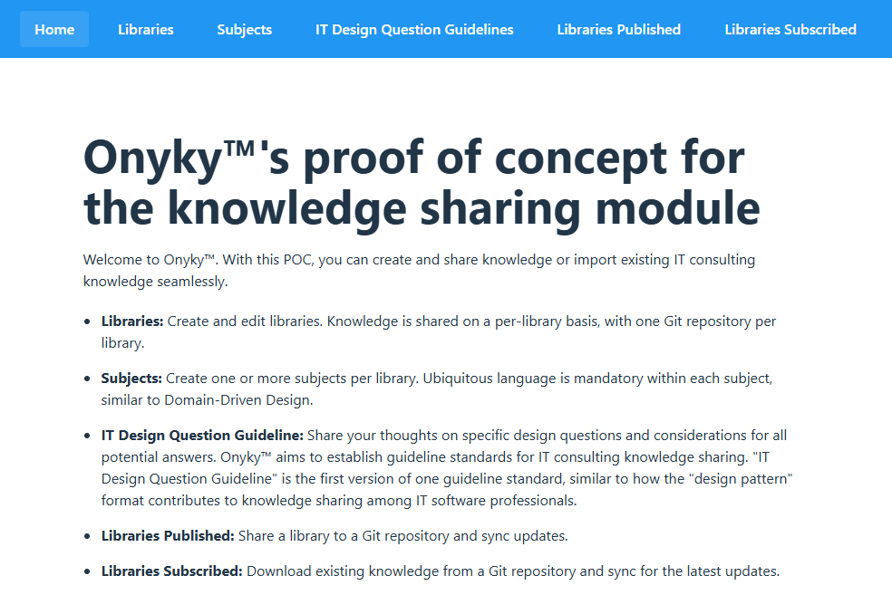
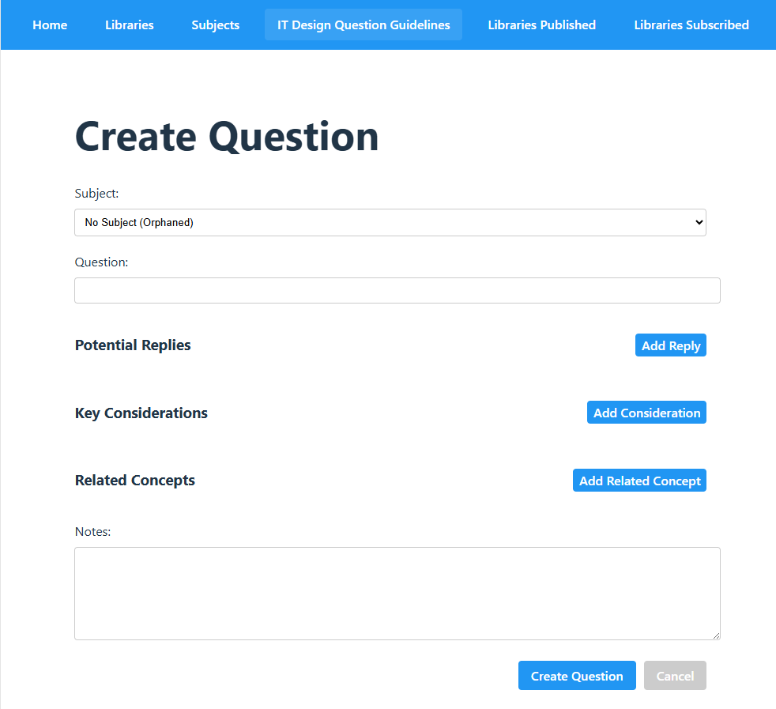

# Onyku™

- Website: https://calvetit.com/onyku/

Onyku™ is an open-source project aimed at creating an IT design standard, guideline standards, and developing an IT design software that adheres to them. This software facilitates the creation and sharing of knowledge in these standards, leveraging Git repositories to enhance collaboration among IT professionals

The product is in its very early stages, with only a basic proof of concept for the knowledge-sharing module, which is **not** production-ready.  
We aim to hire a senior software engineer as soon as financially feasible, who will be responsible for redesigning it and building the core product.  

The software is currently maintained by the founder, who has an infrastructure background rather than a software engineering background.  
This project is currently serving as a learning platform.

# Warning

As mentioned above, I am not a developer yet.  
So, I strongly suggest reviewing the code, for example the docker commands, to ensure it will not negatively impact your environment, such as affecting resources not related to this application.

# License

This repository is not Open Source yet.
Therefore there is no WARRANTY OF ANY KIND, EXPRESS OR IMPLIED, INCLUDING BUT NOT LIMITED TO THE WARRANTIES OF MERCHANTABILITY, FITNESS FOR A PARTICULAR PURPOSE AND NONINFRINGEMENT. IN NO EVENT SHALL THE AUTHORS OR COPYRIGHT HOLDERS BE LIABLE FOR ANY CLAIM, DAMAGES OR OTHER LIABILITY, WHETHER IN AN ACTION OF CONTRACT, TORT OR OTHERWISE, ARISING FROM, OUT OF OR IN CONNECTION WITH THE SOFTWARE OR THE USE OR OTHER DEALINGS IN THE SOFTWARE.

Calvet IT plans to make this repository Open Source.  
To ensure the correct license from the start, discussions are planned with the community of interested individuals.  
If you would like to join the discussion, please [contact us](https://calvetit.com/contact-us/).


# Getting Started
The plan is to create a Kubernetes application to reduce dependency on the developer platform software and settings.  
It is not the case yet.  
The sofware has been tested so far on a Windows 11 machines with WSL2 and docker desktop installed on Windows.  
To follow an API-first approach during development, the backend and frontend are separated.

# Prerequisites
## Docker Desktop
From Windows start Docker Desktop.
Only first time:
Configure the integration with WSL2.
Settings>Ressources>WSL Integration
Tick "Enable integration with my default WSL distro"
Enable integration with additional distros (Ubuntu in my case)

Docker Desktop must be running before starting the backend.

## Encryption key
```
cd backend/knowledgeSharing/
node -e "console.log(require('crypto').randomBytes(32).toString('hex'))"
```
create the .env file using the .env.example file as template and paste the encryption key generated above.

# Start the application

## Backend

From wsl, open the terminal and run the following commands:
```
cd backend/knowledgeSharing/
npm install
npm run dev
```
It will also create a docker container for the database on Docker Desktop.

## Start the frontend

Then in another terminal, run the following commands:
```
cd frontend/
npm install
npm run dev
```

# Access the application
You can either use a graphQL client to work with the backend directly.
localhost:4000/graphql

Or the recommend way, the frontend GUI.
http://localhost:5173/


# Contributing

The initial community platform is on slack.  
Discussions are planned there to identify which platform to use in the future.  
Please [contact us](https://calvetit.com/contact-us/) to receive an invitation.  

This is a work in progress with some areas still unclear, such as policies for contributing via pull requests.

# Proof of concept walkthrough

See [POC_Walkthrough_2025_02_24.md](./docs/POC_Walkthrough_2025_02_24.md)

# Screenshots

## Home page


## Create a IT Design Question Guideline



