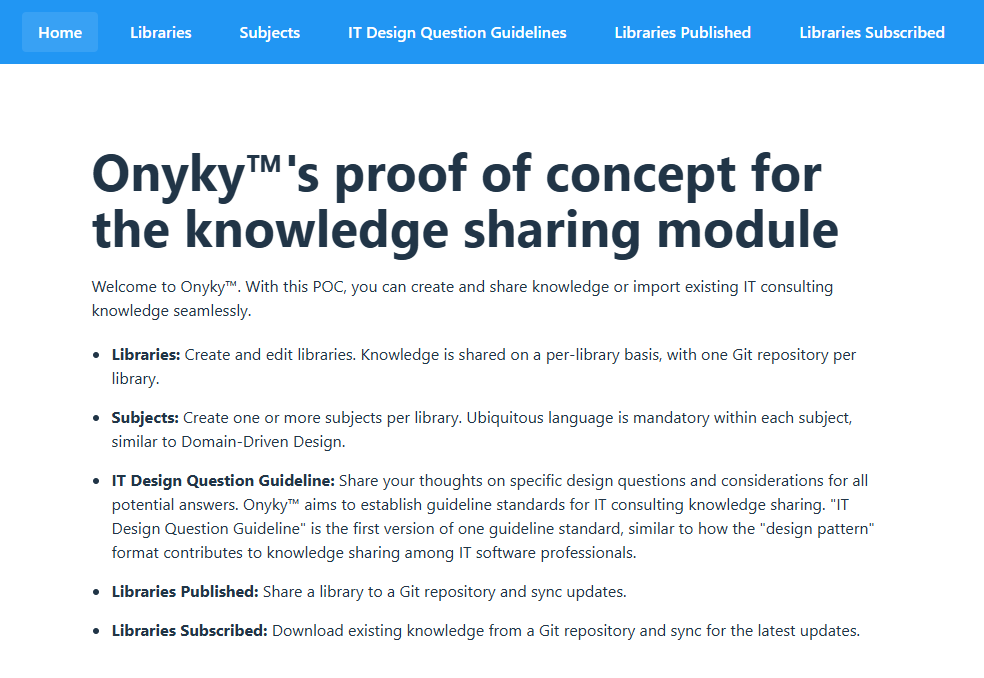

# Proof of concept walkthrough

## Prerequisites
Refer to the [README](../README.md) for prerequisites.  
When the backend and frontend are running, the application is accessible at http://localhost:5173/  

If everything works as expected, you will see the home page.

## Create a library
Knowledge is shared on a per-library basis, with one Git repository per library.  
Click on the Libraries menu.  
On the left, you will see the list of libraries you have already created or subscribed to.  
Click on the "Create" button.  

Provide a name for the library, for example "My Library".  
Provide a description, for example "This is my library".  
Fill the "Maintainer" field. It could be a single person, a team or an organization.  
Knowing the maintainer of the library fosters user trust.  
Click on the "Create Library" button.  

## Create a subject
Create one or more subjects per library.
Ubiquitous language is mandatory within each subject, similar to Domain-Driven Design.  
For example, a libray "VMware" could have a subject for "vSphere" and one for "NSX".  
They can't be on the same "VMware" subject because the terminology "tag" is used by both technologies but with a different technical purpose.

Click on the "Subjects" menu.  
On the left, you will see the list of subjects you have already created or part of a library you have subscribed to.  
Click on the "Create" button.  
For the "Librady" field, select the Library created in the prvious step.  
For the "Name" field, provide a name for the subject, for example "My subject".  
For the "Description" field, provide a description for the subject, for example "This is my subject".  
Click on the "Create Subject" button.  

## Create an IT Design Question Guideline
This is one example of a guideline standard. This is the first version so it will evolve based on community feedback.
Sharing different types of knowledge requires multiple standards.  
There will be additional standards later, such as deep dive.

Click on the "IT Design Question Guidelines" menu.  
On the left, you will see the list of IT Design Question Guidelines you have already created or part of a subject you have subscribed to.  
Click on the "Create" button.
You will reach the IT Design Question Guideline creation page.

For the "Subject" field, select the Subject created in the previous step.  
For the Question field, provide a design question for example "Which deployment topology to use?"

### Add the first potential reply.
Click on the "Add Reply" button.  
Fill the "Example reply" field, for example "Deployment toplogy A selected".

#### Add one or many potential requirements.
A potential requirement is an example of a customer requirement that could have led to the selected reply.
It could a real past customer requirement shared by an IT professional.
Click on the "Add Requirement" button.
Fill the "Example requirement" field.

For example: "The customer requires a 99.99% uptime SLA".

#### Add one or many potential constraints leading to this reply.
Same logic as potential requirements, but for constraints.  

For example: "There is a latency above 100 ms between the two datacenters".

#### Add one or more assumptions leading to this reply.
Same logic as potential requirements, but for assumptions.

For example: "The two datacenters are in the same region, so the latency should be below 10 ms".  
Reminder: Assumptions must be confirmed, or they become poorly written risks if incorrect.”  

#### Add one or more potential risks resulting from this decision.
Same logic as potential requirements, but for risks.  

For example: "If the physical datacenter is hit by a natual disaster, the recovery time will be very high and SLA will be breached".

#### Add potential arguments supporting this reply.
For example:
"It covers the customer requirement of 99.99% uptime SLA".

##### Add the impact of this argument.
Click Add Impact and select:  
the impact property. e.g. "availability", "manageability"  
the impact type "positive" "negative" "neutral"  
optional notes.  
For example:
For the argument "It covers the customer requirement of 99.99% uptime SLA": 
Availability: positive  
For the argument "It respects technical constraints ...":
Performance: negative

### Add a second potential reply.
Example: "Deployment topology B selected".

### Add one or more key considerations
Click on the "Add Consideration" button.  
Fill the description, for example:  
The topology A requires a specific license.   
##### Optional ddd one or more references
Example a link to the official documentation.
A book.
A blog post.

### Add Related concepts.
This part is not implemented yet.  
The idea is to reuse the concept of "Relation with others patterns" from the "Design pattern" in software design.
Because IT design have a lot of concepts, refering to one specific name is not practical moreover there will be scenario where one Design Question Guideline will be related to another concept in another subject or even another library which may not have been created yet.
So the idea is to create a "query" language to find the related concept instead.

In a vSphere NSX network topology question there could be a query like:
Query: Subject: "physical network" "Fabric type"
And the description could be something like:
The design option A and B requires a physical network fabric type of type "layer 2 stretched".
When the user will click on the "query" button, the related concepts will be displayed if already downloaded or created.

## Save the IT Design Question Guideline
Click on the "Create question" button.

## Publish the library
The main purpose of Onyku™ is to share knowledge.  
Prerequisites:
- A **TEST** GitHub account.
- A Personal Access Token with the right to create repositories on this account.

Even is the PAT is encrypted in the backend, the frontend is NOT encrypted yet.  
Moreover, the encryption may not be properly implemented in the backend.  
This is an illustration of why a senior software engineer is essential for this project before releasing a production-ready application.  

Click on the "Libraries Published" menu.  
On the left, you will see the list of libraries you have already published.  
Click on the "Publish" button.

In the new page.
Select the library to publish.
Select the GitProvider. Warning: It is only possible to publish to GitHub for now.
Select the full repository url. For example: https://github.com/username/repositoryname
Fill the Personal Access Token.  
Select the visibility, PRIVATE or PUBLIC.
Click Publish

## Push updates to a published library
Add, modidy or delete any content in the Library using Libraries,Subjects or IT Design Question Guidelines menus.
Then on the published library page, select the library on the left anc click Sync Menu.

The new page displays information about the published Library and when was the last sync.
Click on the "Sync Now" button.

In the GitHub repository, the main branch has been updated and there is a new commit with the latest changes.
There is probably a better way to perform these operations. It is only a POC at this stage.

## Subscribe to a published library
Click on the "Libraries subscribed" menu.
On the left, you will see the list of libraries you have already subscribed to.
Click on the "Subscribe" button.

In the new page:
Specificy the repository url. For example: https://github.com/username/repositoryname
Specify the GitProvider. Warning: It is only possible to subscribe to GitHub for now.
Select the visbility.
Select a Personal Access Token. It is required for PRIVATE repositories.
Click Subscribe

Find the content of the new library in the Libraries,Subjects and IT Design Question Guidelines menus.

## Download latest updates from a subscribed library
Click on the "Libraries subscribed" menu.
Select the library to sync on the left.
Click the "Sync Menu" button.

In the new page, you will see information about the subscribed library and when was the last sync.
Click on the "Sync Now" button.

Find the content of the updated library in the Libraries,Subjects and IT Design Question Guidelines menus.

